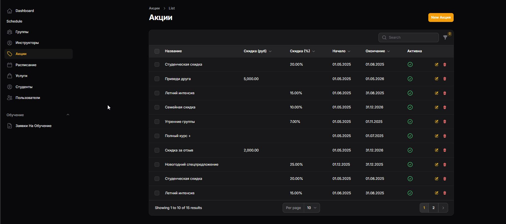

<p align="center"><a href="https://laravel.com" target="_blank"></a></p>

<p align="center">
<a href="https://github.com/laravel/framework/actions"></a>
<a href="https://packagist.org/packages/laravel/framework"></a>
<a href="https://packagist.org/packages/laravel/framework"></a>
<a href="https://packagist.org/packages/laravel/framework"></a>
</p>

# 🚦 Автошкола "Mario Drive"

## 🔄 История технологий

**Изначальный стек**:
- Vue.js (Composition API)

**Проблемы**:
```diff
- Сложности с интеграцией Vue 
- Конфликты версий зависимостей
- Взаимодействие с БД

## 🛠 Технологический стек на данный момент

| Категория       | Технологии                          |
|-----------------|-------------------------------------|
| Backend         | Laravel 10, PHP 8.2                 |
| Frontend        | Tailwind CSS                        |
| Админ-панель    | Filament PHP 3                      |
| База данных     | MySQL 8                             |


## 📌 О проекте
Профессиональная платформа для автоматизации процессов автошколы с:
- Публичным сайтом для клиентов
- Административной панелью
- Личными кабинетами учеников и инструкторов (в разработке)

## 🏗️ Выполненная работа

### 🔍 Исследовательская фаза
| Этап                         | Детали                                  |
|------------------------------|-----------------------------------------|
| 1️⃣ Глубокое изучение ПО     | Анализ 15+ аналогов                     |
| 2️⃣ Попытка внедрения Vue.js | Изучение за 1 неделю, проблемы с SSR    |
| 3️⃣ Переход на Laravel       | Освоение на данный момент               |
| 4️⃣ Изучение Filament        | интенсивное обучение на данный момент   |

### 🛠️ Реализованный функционал
**🌐 Публичная часть:**
- ✔️ Лендинг с адаптивным дизайном
- ✔️ Блоки: курсы, цены, инструкторы
- ✔️ Система заявок (форма + валидация)

**🔧 Администрирование:**
- ✔️ CRUD для заявок/пользователей
- ✔️ Визуальный дашборд
- ✔️ Система ролей (админ)

**🗃️ База данных:**
🚧 Оставшиеся задачи
1️⃣ Личный кабинет ученика
Просмотр персонального расписания
История оплат с фильтрами
Система уведомлений

2️⃣ Личный кабинет инструктора
Календарь занятий
Отметка посещаемости
Статистика загруженности

3️⃣ Расписание
Интерактивный конструктор
Конфликты времени

### 🚀 Запуск проекта
bash
# 1. Установка
git clone https://github.com/ваш-проект.git
composer install

# 2. Настройка
cp .env.example .env
php artisan key:generate

# 3. База данных
mysql -e "CREATE DATABASE mario_drive"
php artisan migrate --seed

# 4. Запуск
php artisan serve

## 📸 Скриншоты системы

### Главная страница

